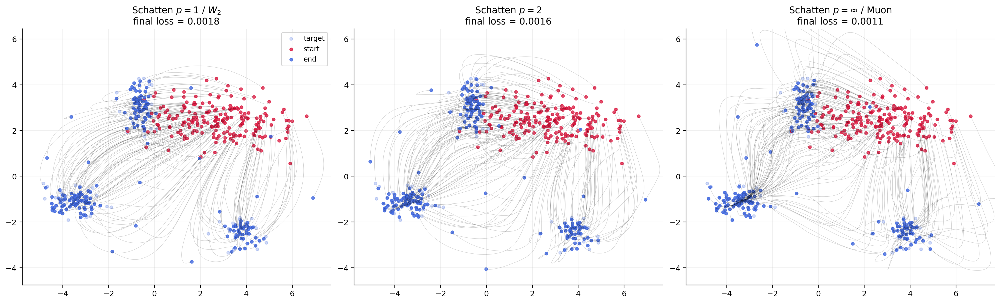
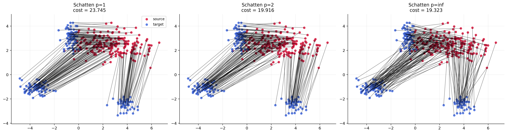

# Muon Dynamics as a Spectral Wasserstein Flow

Author: Gabriel Peyré

This repository accompanies the article

> Muon Dynamics as a Spectral Wasserstein Flow, Gabriel Peyré, [arXiv:2604.04891](http://arxiv.org/abs/2604.04891), 2026.

The project studies matrix-normalized optimization rules, with Muon as the motivating example, through a mean-field transport viewpoint. The core object is a family of Spectral Wasserstein distances indexed by a norm $\gamma$ on positive semidefinite matrices:

```math
\mathsf W_{\gamma}(\mu,\nu)^2
=
\inf_{\pi\in\Pi(\mu,\nu)}
\gamma\!\left(
\int (y-x)(y-x)^\top\,d\pi(x,y)
\right).
```

Two benchmark choices are:

- $\gamma(S)=\mathrm{tr}(S)$, which recovers the classical $W_2^2$ geometry.
- $\gamma(S)=\lambda_{\max}(S)$, which gives the Muon or operator-norm geometry.

Intermediate Schatten norms, such as the Frobenius case $p=2$, interpolate between these two extremes.

This repository contains:

- the paper source in `neurips/` and the generated figures used by the manuscript;
- reproducible notebooks for static spectral transport couplings and MMD gradient flows;
- additional notebooks for Gaussian reductions, two-layer ReLU training, and shallow attention;
- helper scripts that regenerate the notebooks from plain Python sources.

The figure below illustrates MMD gradient flows under different spectral geometries. They optimize the same objective, but move the particle cloud through different collective directions.



## Notebooks

### MMD Gradient Flow

[](https://github.com/gpeyre/muon-dynamics/blob/main/python/mmd/mmd_flow.ipynb)

[](https://colab.research.google.com/github/gpeyre/muon-dynamics/blob/main/python/mmd/mmd_flow.ipynb)

### Static Couplings

[](https://github.com/gpeyre/muon-dynamics/blob/main/python/static/static_couplings.ipynb)

[](https://colab.research.google.com/github/gpeyre/muon-dynamics/blob/main/python/static/static_couplings.ipynb)

Additional experiments are documented in [`python/README.md`](./python/README.md):

- `python/gaussians/gaussian_closed_form.ipynb`;
- `python/gaussians-kl-flow/gaussian-kl-flow.ipynb`;
- `python/mlp/mlp_spectral_flow_relu.ipynb`;
- `python/attention/attention_spectral_flow.ipynb`.

## Reproducing the Numerics

The notebooks use standard scientific Python packages listed in `requirements.txt`. From the repository root, a typical setup and run is:

```bash
python -m pip install -r requirements.txt
cd python/mmd
python generate_mmd_notebook.py
jupyter nbconvert --to notebook --execute --inplace mmd_flow.ipynb
```

The generated PDF figures are written under `neurips/figures/fig-*`, where the LaTeX source includes them.

## Building the Paper

The active LaTeX source is in `neurips/`. From that directory, run:

```bash
pdflatex paper.tex
bibtex paper
pdflatex paper.tex
pdflatex paper.tex
```

The `arxiv/` directory is treated as a generated export bundle and is ignored by git.
