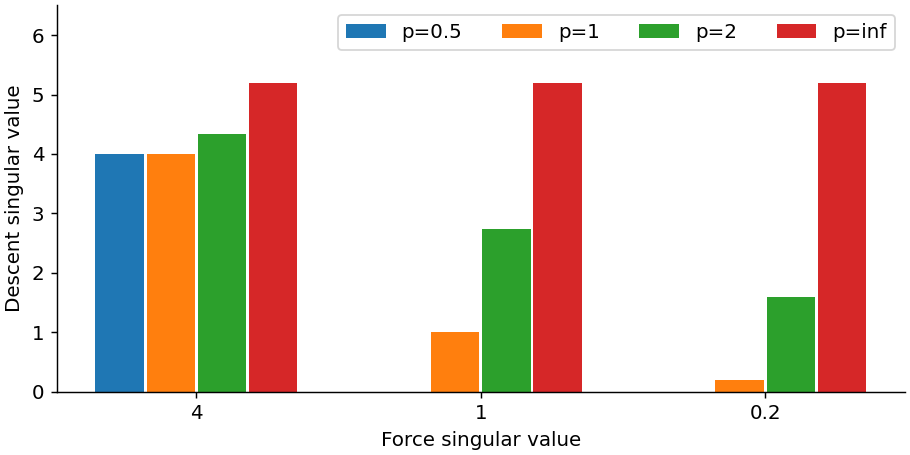
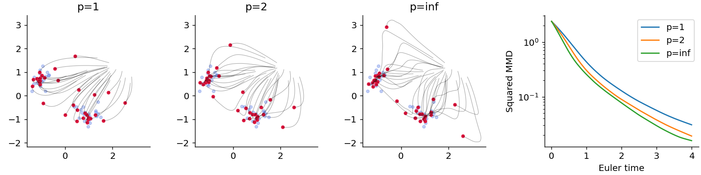
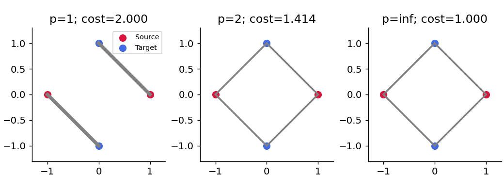
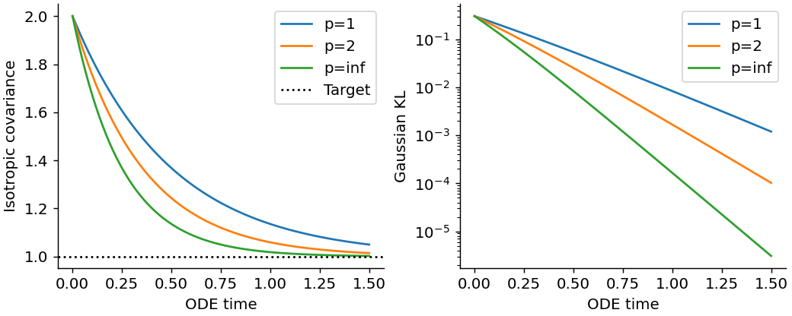
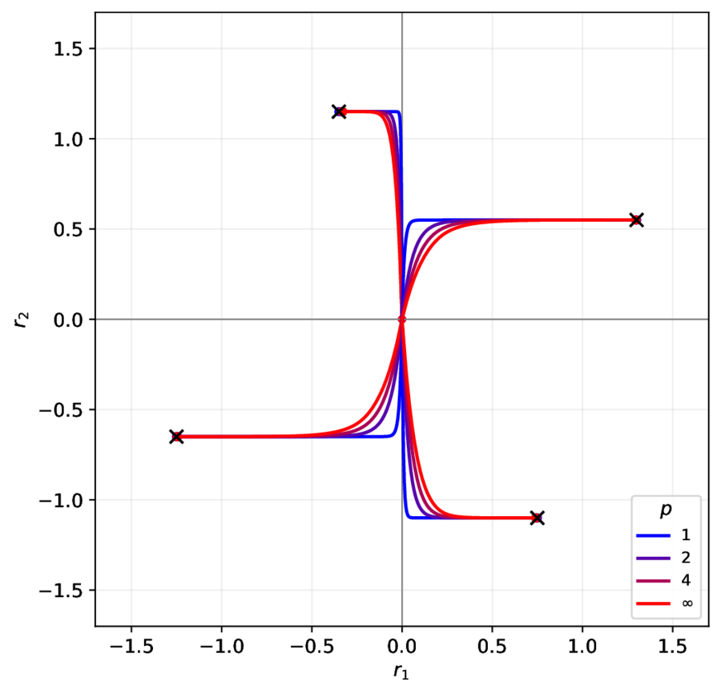
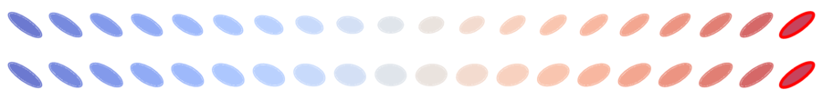
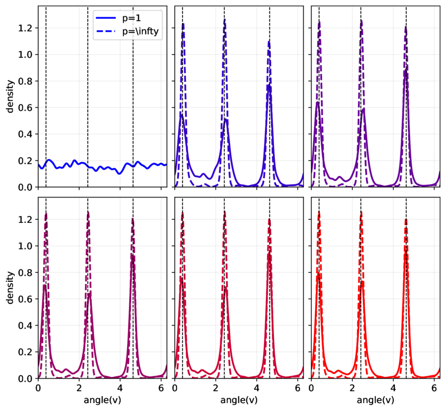
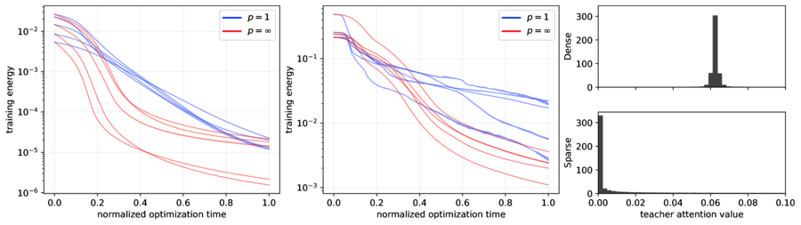

# Muon Dynamics as a Spectral Wasserstein Flow

Author: Gabriel Peyré

This repository accompanies the article

> Muon Dynamics as a Spectral Wasserstein Flow, Gabriel Peyré, [arXiv:2604.04891](http://arxiv.org/abs/2604.04891), 2026.

The project studies matrix-normalized optimization rules, with Muon as the motivating example, through a mean-field transport viewpoint. The core object is a family of Spectral Wasserstein distances indexed by a norm $\gamma$ on positive semidefinite matrices:

```math
\mathsf W_{\gamma}(\mu,\nu)^2
=
\inf_{\pi\in\Pi(\mu,\nu)}
\gamma\!\left(
\int (y-x)(y-x)^\top\,d\pi(x,y)
\right).
```

Two benchmark choices are:

- $\gamma(S)=\mathrm{tr}(S)$, which recovers the classical $W_2^2$ geometry.
- $\gamma(S)=\lambda_{\max}(S)$, which gives the Muon or operator-norm geometry.

Intermediate Schatten norms, such as the Frobenius case $p=2$, interpolate between these two extremes.

This repository contains:

- an installable computational toolbox in [`src/muon_dynamics/`](./src/muon_dynamics/), with NumPy and optional PyTorch APIs;
- four short [teaching notebooks](#small-examples) for spectral directions, particle flows, transport, and Gaussian closures;
- the paper source in `neurips/` and the generated figures used by the manuscript;
- six [experiment notebooks](#paper-experiments), an isolated figure-reproduction runner, and numerical tests.

## Quick Start

From a clone of this repository, with Python 3.10 or later:

```bash
python -m pip install -e '.[notebooks,transport]'
python -m unittest discover -s tests -v
python scripts/reproduce.py --examples --output outputs/examples
```

For just the NumPy/SciPy toolbox, use `pip install -e .`. For all paper
experiments, including PyTorch training, use `pip install -r requirements.txt`.

```python
import numpy as np
from muon_dynamics import mmd_force, particle_lmo

rng = np.random.default_rng(7)
x = rng.normal(size=(32, 2))
target = rng.normal(size=(48, 2)) + [2., 0.]
velocity = particle_lmo(mmd_force(x, target), p=np.inf)
x = x + 0.01 * velocity
```

See the [toolbox API and normalization conventions](./docs/toolbox.md) and
[reproduction guide](./docs/reproducibility.md). The LMO includes the negative
sign and dual-norm scale; it is not the unscaled polar update used in practical
Muon optimizers.

The figure below illustrates MMD gradient flows under different spectral geometries. They optimize the same objective, but move the particle cloud through different collective directions.


## Small Examples

Short, seeded notebooks that call the toolbox directly, without full neural-network training:

| Preview | Notebook | Open |
| --- | --- | --- |
|  | [Spectral directions](./python/examples/01_spectral_directions.ipynb): LMOs, weights, and endpoints | [](https://github.com/gpeyre/muon-dynamics/blob/main/python/examples/01_spectral_directions.ipynb) |
|  | [Particle MMD](./python/examples/02_particle_mmd.ipynb): a small flow under three geometries | [](https://github.com/gpeyre/muon-dynamics/blob/main/python/examples/02_particle_mmd.ipynb) |
|  | [Static transport](./python/examples/03_static_transport.ipynb): why optimal plans can split mass | [](https://github.com/gpeyre/muon-dynamics/blob/main/python/examples/03_static_transport.ipynb) |
|  | [Gaussian KL](./python/examples/04_gaussian_kl.ipynb): covariance dynamics and energy decay | [](https://github.com/gpeyre/muon-dynamics/blob/main/python/examples/04_gaussian_kl.ipynb) |

## Paper Experiments

All experiment notebooks are in [`python/`](./python/README.md). Each one can be
opened on GitHub. For Colab, clone the repository and install its experiment
dependencies before running from the notebook's directory; the static example
also needs the images in `python/data/`. The isolated runner below handles
these paths locally. The three-geometry README previews are illustrative;
the linked paper notebooks use their documented experimental settings.

### Static Spectral Couplings

[](https://github.com/gpeyre/muon-dynamics/blob/main/python/static/static_couplings.ipynb)

[](https://github.com/gpeyre/muon-dynamics/blob/main/python/static/static_couplings.ipynb)
[](https://colab.research.google.com/github/gpeyre/muon-dynamics/blob/main/python/static/static_couplings.ipynb)

Planar point-cloud couplings: exact trace assignment and heuristic operator matching. The latter is not a certified spectral OT solve or geodesic; the small static example above solves full convex couplings.

### MMD Gradient Flow

[](https://github.com/gpeyre/muon-dynamics/blob/main/python/mmd/mmd_flow.ipynb)

[](https://github.com/gpeyre/muon-dynamics/blob/main/python/mmd/mmd_flow.ipynb)
[](https://colab.research.google.com/github/gpeyre/muon-dynamics/blob/main/python/mmd/mmd_flow.ipynb)

Particle flows minimizing an MMD loss under different Spectral Wasserstein geometries.

### Gaussian Closed-Form Reductions

[](https://github.com/gpeyre/muon-dynamics/blob/main/python/gaussians/gaussian_closed_form.ipynb)

[](https://github.com/gpeyre/muon-dynamics/blob/main/python/gaussians/gaussian_closed_form.ipynb)
[](https://colab.research.google.com/github/gpeyre/muon-dynamics/blob/main/python/gaussians/gaussian_closed_form.ipynb)

Closed-form Gaussian dynamics, conserved leaves, and rank-one/rank-two covariance trajectories.

### Gaussian KL Flow

[](https://github.com/gpeyre/muon-dynamics/blob/main/python/gaussians-kl-flow/gaussian-kl-flow.ipynb)

[](https://github.com/gpeyre/muon-dynamics/blob/main/python/gaussians-kl-flow/gaussian-kl-flow.ipynb)
[](https://colab.research.google.com/github/gpeyre/muon-dynamics/blob/main/python/gaussians-kl-flow/gaussian-kl-flow.ipynb)

Centered Gaussian covariance flows for the KL functional, sampled by covariance arclength.

### Two-Layer ReLU Training

[](https://github.com/gpeyre/muon-dynamics/blob/main/python/mlp/mlp_spectral_flow_relu.ipynb)

[](https://github.com/gpeyre/muon-dynamics/blob/main/python/mlp/mlp_spectral_flow_relu.ipynb)
[](https://colab.research.google.com/github/gpeyre/muon-dynamics/blob/main/python/mlp/mlp_spectral_flow_relu.ipynb)

Mean-field training of a two-layer ReLU network in two dimensions under trace and Muon-type flows.

### Shallow Attention

[](https://github.com/gpeyre/muon-dynamics/blob/main/python/attention/attention_spectral_flow.ipynb)

[](https://github.com/gpeyre/muon-dynamics/blob/main/python/attention/attention_spectral_flow.ipynb)
[](https://colab.research.google.com/github/gpeyre/muon-dynamics/blob/main/python/attention/attention_spectral_flow.ipynb)

Mean-field shallow multi-head attention trained against a random teacher across dense and sparse attention regimes.

## Reproducing the Numerics

From the repository root:

```bash
python -m pip install -r requirements.txt
python scripts/reproduce.py --check
python scripts/reproduce.py --all --smoke --output outputs/smoke
python scripts/reproduce.py mmd --output outputs/mmd-full
```

The runner saves executed notebooks, PDFs, and a `run.json` provenance record
under the selected output directory, leaving manuscript figures untouched.
`--smoke` uses reduced settings and is not a reproduction of the reported
results. Omit it for full runs; MLP and attention can be expensive. See the
[experiment map and numerical caveats](./docs/reproducibility.md).

Continuous integration runs the numerical tests, the four teaching notebooks,
and reduced versions of all six paper experiments.

## Building the Paper

The active LaTeX source is in `neurips/`. From that directory, run:

```bash
pdflatex paper.tex
bibtex paper
pdflatex paper.tex
pdflatex paper.tex
```

The `arxiv/` directory is treated as a generated export bundle and is ignored by git.
